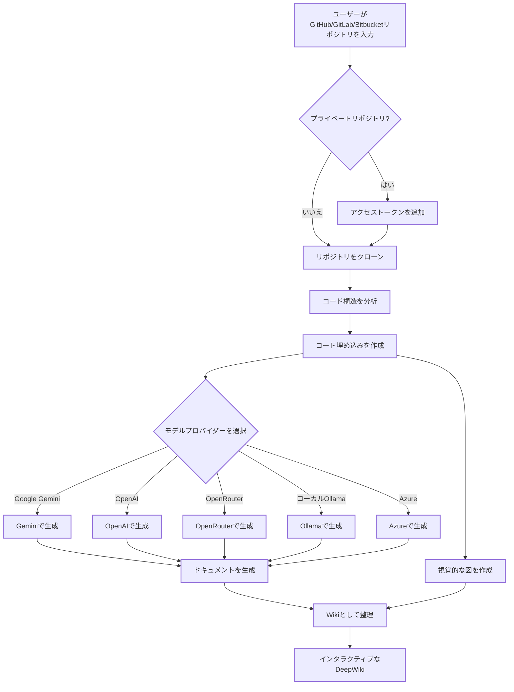

# DeepWiki-Open


**DeepWiki**は、GitHub、GitLab、または Bitbucket リポジトリのための美しくインタラクティブな Wiki を自動的に作成します！リポジトリ名を入力するだけで、DeepWiki は以下を行います：

1. コード構造を分析
2. 包括的なドキュメントを生成
3. すべての仕組みを説明する視覚的な図を作成
4. すべてを簡単に閲覧できる Wiki に整理

[](https://buymeacoffee.com/sheing)
[](https://tip.md/sng-asyncfunc)
[](https://x.com/sashimikun_void)
[](https://discord.com/invite/VQMBGR8u5v)

[English](./README.md) | [日本語](./README.ja.md)

## ✨ 特徴

- **即時ドキュメント生成**: あらゆる GitHub、GitLab、または Bitbucket リポジトリを数秒で Wiki に変換
- **プライベートリポジトリ対応**: 個人アクセストークンを使用してプライベートリポジトリに安全にアクセス
- **スマート分析**: AI を活用したコード構造と関係の理解
- **美しい図表**: アーキテクチャとデータフローを視覚化する自動 Mermaid 図
- **簡単なナビゲーション**: Wiki を探索するためのシンプルで直感的なインターフェース
- **質問機能**: RAG 搭載 AI を使用してリポジトリとチャットし、正確な回答を得る
- **詳細調査**: 複雑なトピックを徹底的に調査する多段階研究プロセス
- **複数のモデルプロバイダー**: Google Gemini、OpenAI、OpenRouter、およびローカル Ollama モデルのサポート
- **柔軟な埋め込み**: OpenAI、Google AI、またはローカル Ollama 埋め込みから最適なものを選択

## 🚀 クイックスタート（超簡単！）

### オプション 1: Docker を使用

```bash
# リポジトリをクローン
git clone git@github.com:grassfieldk/deepwiki-open.git
cd deepwiki-open

# API キーを含む .env ファイルを作成
echo "GOOGLE_API_KEY=your_google_api_key" > .env
echo "OPENAI_API_KEY=your_openai_api_key" >> .env
# オプション: OpenAI の代わりに Google AI embeddings を使用する場合（Google モデルを使用する場合推奨）
echo "DEEPWIKI_EMBEDDER_TYPE=google" >> .env
# オプション: OpenRouter モデルを使用する場合は OpenRouter API キーを追加
echo "OPENROUTER_API_KEY=your_openrouter_api_key" >> .env
# オプション: Ollama がローカルでない場合は Ollama ホストを追加。デフォルト: http://localhost:11434
echo "OLLAMA_HOST=your_ollama_host" >> .env
# オプション: Azure OpenAI モデルを使用する場合は Azure API キー、エンドポイント、バージョンを追加
echo "AZURE_OPENAI_API_KEY=your_azure_openai_api_key" >> .env
echo "AZURE_OPENAI_ENDPOINT=your_azure_openai_endpoint" >> .env
echo "AZURE_OPENAI_VERSION=your_azure_openai_version" >> .env
# Run with Docker Compose
docker-compose up
```

OllamaとDockerの詳細な使用方法については、[Ollama Instructions](Ollama-instruction.md)を参照してください。

> 💡 **これらのキーの入手先:**
> - Google API キーは[Google AI Studio](https://makersuite.google.com/app/apikey)から取得
> - OpenAI API キーは[OpenAI Platform](https://platform.openai.com/api-keys)から取得
> - Azure OpenAI 認証情報は[Azure Portal](https://portal.azure.com/)から取得 - Azure OpenAI リソースを作成し、APIキー、エンドポイント、APIバージョンを取得

### オプション 2: 手動セットアップ（推奨）

#### ステップ 1: API キーの設定

プロジェクトのルートに .env ファイルを作成し、以下のキーを追加します：

```
GOOGLE_API_KEY=your_google_api_key
OPENAI_API_KEY=your_openai_api_key
# オプション: OpenAI の代わりに Google AI embeddings を使用する場合（Google モデルを使用する場合推奨）
DEEPWIKI_EMBEDDER_TYPE=google
# オプション: OpenRouter モデルを使用する場合は追加
OPENROUTER_API_KEY=your_openrouter_api_key
# オプション: Azure OpenAI モデルを使用する場合は追加
AZURE_OPENAI_API_KEY=your_azure_openai_api_key
AZURE_OPENAI_ENDPOINT=your_azure_openai_endpoint
AZURE_OPENAI_VERSION=your_azure_openai_version
# オプション: Ollama がローカルでない場合は追加。デフォルト: http://localhost:11434
OLLAMA_HOST=your_ollama_host
```

#### ステップ 2: バックエンドの起動

```bash
# Python の依存関係をインストール
python -m pip install poetry==2.0.1 && poetry install -C api

# API サーバーを起動
python -m api.main
```

#### ステップ 3: フロントエンドの起動

```bash
# JavaScript 依存関係をインストール
npm install
# または
yarn install

# Web アプリを起動
npm run dev
# または
yarn dev
```

#### 代替: 1つのコマンドでフロントエンドとバックエンドの両方を起動

両方のサービスを1つのコマンドで起動する場合：

```bash
# フロントエンドとバックエンドの両方の依存関係をインストール
npm install
python -m pip install poetry==2.0.1 && poetry install -C api

# フロントエンドとバックエンドの両方を起動
npm run dev:front & npm run dev:backend
```

#### ステップ 4: DeepWiki を使用！

1. ブラウザで[http://localhost:3000](http://localhost:3000)を開く
2. GitHub、GitLab、または Bitbucket リポジトリを入力（例：`https://github.com/openai/codex`、`https://github.com/microsoft/autogen`、`https://gitlab.com/gitlab-org/gitlab`、または`https://bitbucket.org/redradish/atlassian_app_versions`）
3. プライベートリポジトリの場合は、「+ アクセストークンを追加」をクリックして GitHub または GitLab の個人アクセストークンを入力
4. 「Wiki を生成」をクリックして、魔法が起こるのを見守りましょう！

### オプション 3: VS Code Dev Containers（開発に推奨）

VS Code で Dev Containers を使用して DeepWiki を開発する場合：

#### 前提条件

1. [VS Code](https://code.visualstudio.com/) をインストール
2. [Dev Containers 拡張機能](https://marketplace.visualstudio.com/items?itemName=ms-vscode-remote.remote-containers) をインストール

#### セットアップ手順

1. **リポジトリをクローン**:
   ```bash
   git clone git@github.com:grassfieldk/deepwiki-open.git
   cd deepwiki-open
   ```

2. **API キーを含む .env ファイルを作成**:
   ```bash
   echo "GOOGLE_API_KEY=your_google_api_key" > .env
   echo "OPENAI_API_KEY=your_openai_api_key" >> .env
   # オプション: OpenAI の代わりに Google AI embeddings を使用する場合（Google モデルを使用する場合推奨）
   echo "DEEPWIKI_EMBEDDER_TYPE=google" >> .env
   # オプション: OpenRouter モデルを使用する場合は OpenRouter API キーを追加
   echo "OPENROUTER_API_KEY=your_openrouter_api_key" >> .env
   # オプション: Ollama がローカルでない場合は Ollama ホストを追加。デフォルト: http://localhost:11434
   echo "OLLAMA_HOST=your_ollama_host" >> .env
   # オプション: Azure OpenAI モデルを使用する場合は Azure API キー、エンドポイント、バージョンを追加
   echo "AZURE_OPENAI_API_KEY=your_azure_openai_api_key" >> .env
   echo "AZURE_OPENAI_ENDPOINT=your_azure_openai_endpoint" >> .env
   echo "AZURE_OPENAI_VERSION=your_azure_openai_version" >> .env
   ```

3. **VS Code で開く**:
   - VS Code を開く
   - `File > Open Folder` を使用して `deepwiki-open` ディレクトリを開く
   - 「フォルダに Dev Container 設定ファイルが含まれています。フォルダをローカルで再度開くか、コンテナ内で再度開きますか？」と表示されたら、「コンテナ内で再度開く」をクリック
   - または、コマンドパレット（`Ctrl+Shift+P`）を使用して「Dev Containers: Reopen in Container」を選択

4. **コンテナのビルドを待つ**:
   - プロジェクトを初めて開く場合、VS Code は開発コンテナをビルドします
   - すべての依存関係がインストールされるため、数分かかる場合があります

5. **開発を開始**:
   - コンテナの準備ができたら、以下のコマンドでフロントエンドとバックエンドの両方を起動できます：
     ```bash
     npm run dev:front & npm run dev:backend
     ```
   - または、異なるターミナルで個別に実行

6. **アプリケーションにアクセス**:
   - ブラウザで [http://localhost:3000](http://localhost:3000) を開く
   - アプリケーションはコンテナ内で実行されますが、ホストからアクセス可能です

#### Dev Containers の利点

- **一貫した環境**: チーム全員が同じ開発環境を使用
- **ローカルセットアップ不要**: すべての依存関係がコンテナにプリインストール
- **隔離された開発**: ローカルマシンをクリーンに保つ
- **簡単なオンボーディング**: 新しい開発者がすぐにコーディングを開始可能

## 🔍 仕組み

DeepWiki は AI を使用して：

1. GitHub、GitLab、または Bitbucket リポジトリをクローンして分析（トークン認証によるプライベートリポジトリを含む）
2. スマート検索のためのコードの埋め込みを作成
3. コンテキスト対応 AI でドキュメントを生成（Google Gemini、OpenAI、OpenRouter、Azure OpenAI、またはローカル Ollama モデルを使用）
4. コードの関係を説明する視覚的な図を作成
5. すべてを構造化された Wiki に整理
6. 質問機能を通じてリポジトリとのインテリジェントな Q&A を可能に
7. 詳細調査機能で深い研究能力を提供



## 🛠️ プロジェクト構造

```
deepwiki/
├── api/                  # バックエンド API サーバー
│   ├── main.py           # API エントリーポイント
│   ├── api.py            # FastAPI 実装
│   ├── rag.py            # 検索拡張生成
│   ├── data_pipeline.py  # データ処理ユーティリティ
│   └── requirements.txt  # Python 依存関係
│
├── src/                  # フロントエンド Next.js アプリ
│   ├── app/              # Next.js アプリディレクトリ
│   │   └── page.tsx      # メインアプリケーションページ
│   └── components/       # React コンポーネント
│       └── Mermaid.tsx   # Mermaid 図レンダラー
│
├── public/               # 静的アセット
├── package.json          # JavaScript 依存関係
└── .env                  # 環境変数（作成する必要あり）
```

## 🤖 プロバイダーベースのモデル選択システム

DeepWikiでは、複数のLLMプロバイダーをサポートする柔軟なプロバイダーベースのモデル選択システムを実装しています：

### サポートされているプロバイダーとモデル

- **Google**: デフォルト `gemini-2.5-flash`、また `gemini-2.5-flash-lite`、`gemini-2.5-pro` などもサポート
- **OpenAI**: デフォルト `gpt-5-nano`、また `gpt-5`、`4o` などもサポート
- **OpenRouter**: Claude、Llama、Mistralなど、統一APIを通じて複数のモデルにアクセス
- **Azure OpenAI**: デフォルト `gpt-4o`、また `o4-mini` などもサポート
- **Ollama**: `llama3` などのローカルで実行するオープンソースモデルをサポート

### 環境変数

各プロバイダーには、対応するAPI鍵の環境変数が必要です：

```
# API鍵
GOOGLE_API_KEY=あなたのGoogle API鍵        # Google Geminiモデルに必要
OPENAI_API_KEY=あなたのOpenAI鍵            # OpenAIモデルに必要
OPENROUTER_API_KEY=あなたのOpenRouter鍵    # OpenRouterモデルに必要
AZURE_OPENAI_API_KEY=あなたのAzure OpenAI API鍵  # Azure OpenAIモデルに必要
AZURE_OPENAI_ENDPOINT=あなたのAzure OpenAIエンドポイント  # Azure OpenAIモデルに必要
AZURE_OPENAI_VERSION=あなたのAzure OpenAIバージョン  # Azure OpenAIモデルに必要

# OpenAI APIベースURL設定
OPENAI_BASE_URL=https://カスタムAPIエンドポイント.com/v1  # オプション、カスタムOpenAI APIエンドポイント用

# Ollamaホスト
OLLAMA_HOST=あなたのOllamaホスト # オプション、Ollamaがローカルでない場合。デフォルト: http://localhost:11434

# 設定ディレクトリ
DEEPWIKI_CONFIG_DIR=/path/to/custom/config/dir  # オプション、カスタム設定ファイルの場所用
```

### 設定ファイル

DeepWikiはシステムの様々な側面を管理するためにJSON設定ファイルを使用しています：

1. **`generator.json`**: テキスト生成モデルの設定
   - 利用可能なモデルプロバイダー（Google、OpenAI、OpenRouter、Azure、Ollama）を定義
   - 各プロバイダーのデフォルトおよび利用可能なモデルを指定
   - temperatureやtop_pなどのモデル固有のパラメータを含む

2. **`embedder.json`**: 埋め込みモデルとテキスト処理の設定
   - ベクトルストレージ用の埋め込みモデルを定義
   - RAG用の検索設定を含む
   - ドキュメントチャンク分割のためのテキスト分割設定を指定

3. **`repo.json`**: リポジトリ処理の設定
   - 特定のファイルやディレクトリを除外するファイルフィルターを含む
   - リポジトリサイズ制限と処理ルールを定義

デフォルトでは、これらのファイルは`api/config/`ディレクトリにあります。`DEEPWIKI_CONFIG_DIR`環境変数を使用して、その場所をカスタマイズできます。

### サービスプロバイダー向けのカスタムモデル選択

カスタムモデル選択機能は、あなたの組織のユーザーに様々なAIモデルの選択肢を提供するために特別に設計されています：

- あなたは組織内のユーザーに様々なAIモデルの選択肢を提供できます
- あなたはコード変更なしで急速に進化するLLM環境に迅速に適応できます
- あなたは事前定義リストにない専門的またはファインチューニングされたモデルをサポートできます

サービスプロバイダーは、事前定義されたオプションから選択するか、フロントエンドインターフェースでカスタムモデル識別子を入力することで、モデル提供を実装できます。

### エンタープライズプライベートチャネル向けのベースURL設定

OpenAIクライアントのbase_url設定は、主にプライベートAPIチャネルを持つエンタープライズユーザー向けに設計されています。この機能は：

- プライベートまたは企業固有のAPIエンドポイントへの接続を可能に
- 組織が自己ホスト型または独自にデプロイされたLLMサービスを使用可能に
- サードパーティのOpenAI API互換サービスとの統合をサポート

**近日公開**: 将来のアップデートでは、ユーザーがリクエストで自分のAPI鍵を提供する必要があるモードをDeepWikiがサポートする予定です。これにより、プライベートチャネルを持つエンタープライズ顧客は、DeepWikiデプロイメントと認証情報を共有することなく、既存のAPI設定を使用できるようになります。

## 🧩 OpenAI 互換 Embedding モデルを使用する（例: Alibaba Qwen）

OpenAI API と互換性のある Embedding モデル（Alibaba Qwen など）を使用したい場合、以下の手順に従ってください：

1. `api/config/embedder.json` の内容を `api/config/embedder_openai_compatible.json` の内容に置き換えます。
2. プロジェクトルートの .env ファイルで、関連する環境変数を設定します。例えば：
   ```
   OPENAI_API_KEY=your_api_key
   OPENAI_BASE_URL=your_openai_compatible_endpoint
   ```
3. プログラムは自動的に環境変数の値で embedder.json のプレースホルダーを置き換えます。

これにより、コード変更なしで任意の OpenAI 互換 Embedding サービスにシームレスに切り替えることができます。

## 🧠 Google AI Embeddingsを使用する

DeepWikiは、OpenAI embeddings の代替として Google AI の最新 embedding モデルをサポートするようになりました。これにより、Google Geminiモデルをすでに使用している場合、より良い統合が提供されます。

### 特徴

- **最新モデル**: Googleの `text-embedding-004` モデルを使用
- **同じAPIキー**: 既存の `GOOGLE_API_KEY` を使用（追加設定不要）
- **より良い統合**: Google Geminiテキスト生成モデルとの最適化
- **タスク固有**: 意味的類似性、検索、分類タスクをサポート
- **バッチ処理**: 複数のテキストの効率的な処理

### Google AI Embeddingsを有効にする方法

**オプション 1: 環境変数（推奨）**

.envファイルでembedderタイプを設定：

```bash
# 既存のGoogle APIキー
GOOGLE_API_KEY=your_google_api_key

# Google AI embeddingsを有効化
DEEPWIKI_EMBEDDER_TYPE=google
```

**オプション 2: Docker環境**

```bash
docker run -p 8001:8001 -p 3000:3000 \
  -e GOOGLE_API_KEY=your_google_api_key \
  -e DEEPWIKI_EMBEDDER_TYPE=google \
  -v ~/.adalflow:/root/.adalflow \
  ghcr.io/asyncfuncai/deepwiki-open:latest
```

**オプション 3: Docker Compose**

.envファイルに追加：

```bash
GOOGLE_API_KEY=your_google_api_key
DEEPWIKI_EMBEDDER_TYPE=google
```

次に実行：

```bash
docker-compose up
```

### 利用可能なEmbedderタイプ

| タイプ | 説明 | 必要なAPIキー | 備考 |
|------|-------------|------------------|-------|
| `openai` | OpenAI embeddings（デフォルト） | `OPENAI_API_KEY` | `text-embedding-3-small` モデルを使用 |
| `google` | Google AI embeddings | `GOOGLE_API_KEY` | `text-embedding-004` モデルを使用 |
| `ollama` | ローカルOllama embeddings | なし | ローカルOllamaインストールが必要 |

### Google AI Embeddingsを使用する理由

- **一貫性**: Google Geminiでテキスト生成を使用している場合、Google embeddingsはより良い意味的一貫性を提供
- **パフォーマンス**: 検索タスクで優れたパフォーマンスを発揮するGoogleの最新embeddingモデル
- **コスト**: OpenAIと比較して競争力のある価格設定
- **追加設定不要**: テキスト生成モデルと同じAPIキーを使用

### Embedder間の切り替え

異なるembeddingプロバイダー間で簡単に切り替え可能：

```bash
# OpenAI embeddingsを使用（デフォルト）
export DEEPWIKI_EMBEDDER_TYPE=openai

# Google AI embeddingsを使用
export DEEPWIKI_EMBEDDER_TYPE=google

# ローカルOllama embeddingsを使用
export DEEPWIKI_EMBEDDER_TYPE=ollama
```

**注意**: Embedderを切り替える場合、異なるモデルが異なるベクトル空間を生成するため、リポジトリembeddingsを再生成する必要がある場合があります。

### Logging

DeepWikiは診断出力のためにPythonの組み込みloggingモジュールを使用しています。環境変数を使用してverbosityとログファイルの宛先を設定できます：

| 変数        | 説明                                                        | デフォルト                      |
|-----------------|------------------------------------------------------------|------------------------------|
| `LOG_LEVEL`     | Logging レベル（DEBUG, INFO, WARNING, ERROR, CRITICAL）     | INFO                         |
| `LOG_FILE_PATH` | ログファイルのパス。設定すると、このファイルにログが書き込まれます | `api/logs/application.log`   |

デバッグ logging を有効にしてカスタムファイルにログを送信するには：
```bash
export LOG_LEVEL=DEBUG
export LOG_FILE_PATH=./debug.log
python -m api.main
```
またはDocker Composeで：
```bash
LOG_LEVEL=DEBUG LOG_FILE_PATH=./debug.log docker-compose up
```

Docker Composeで実行する場合、コンテナの`api/logs`ディレクトリがホストの`./api/logs`にバインドマウントされます（`docker-compose.yml`の`volumes`セクションを参照）。これにより、再起動後もログファイルが永続化されます。

または、.envファイルにこれらの設定を保存：

```bash
LOG_LEVEL=DEBUG
LOG_FILE_PATH=./debug.log
```
次に単純に実行：

```bash
docker-compose up
```

**Loggingパスセキュリティ考慮事項:** 本番環境では、`api/logs` ディレクトリとカスタムログファイルパスを適切なファイルシステム権限とアクセス制御で保護してください。アプリケーションは`LOG_FILE_PATH`がプロジェクトの`api/logs` ディレクトリ内にあることを強制し、パストラバーサルや不正書き込みを防ぎます。

## 🛠️ 高度な設定

### 環境変数

| 変数             | 説明                                                  | 必須 | 注意                                                                                                     |
|------------------|-------------------------------------------------------|------|----------------------------------------------------------------------------------------------------------|
| `GOOGLE_API_KEY`     | Google Gemini API キー（AI 生成と embeddings 用）      | いいえ | Google Gemini モデルと Google AI embeddings に必要
| `OPENAI_API_KEY`     | OpenAI API キー（embeddings とモデル用）                     | 条件付き | OpenAI embeddings またはモデルを使用する場合に必要                                                            |
| `OPENROUTER_API_KEY` | OpenRouter API キー（代替モデル用）                    | いいえ | OpenRouter モデルを使用する場合にのみ必要                                                       |
| `AZURE_OPENAI_API_KEY` | Azure OpenAI API キー                    | いいえ | Azure OpenAI モデルを使用する場合にのみ必要                                                       |
| `AZURE_OPENAI_ENDPOINT` | Azure OpenAI エンドポイント                    | いいえ | Azure OpenAI モデルを使用する場合にのみ必要                                                       |
| `AZURE_OPENAI_VERSION` | Azure OpenAI バージョン                     | いいえ | Azure OpenAI モデルを使用する場合にのみ必要                                                       |
| `OLLAMA_HOST`        | Ollama ホスト（デフォルト: http://localhost:11434）                | いいえ | 外部 Ollama サーバーを使用する場合にのみ必要                                                  |
| `DEEPWIKI_EMBEDDER_TYPE` | Embedder タイプ: `openai`, `google`, または `ollama`（デフォルト: `openai`） | いいえ | 使用する embedding プロバイダーを制御                                                              |
| `PORT`               | API サーバーのポート（デフォルト: 8001）                      | いいえ | API とフロントエンドを同じマシンでホストする場合、`SERVER_BASE_URL` のポートを適宜変更してください |
| `SERVER_BASE_URL`    | API サーバーのベース URL（デフォルト: http://localhost:8001） | いいえ |
| `DEEPWIKI_AUTH_MODE` | Wiki 生成に認証コードが必要な承認モードを有効にするには `true` または `1` に設定 | いいえ | デフォルトは `false`。有効にした場合、`DEEPWIKI_AUTH_CODE` が必要です。 |
| `DEEPWIKI_AUTH_CODE` | `DEEPWIKI_AUTH_MODE` が有効な場合に Wiki 生成に必要な秘密コード | いいえ | `DEEPWIKI_AUTH_MODE` が `true` または `1` の場合にのみ使用されます。 |

**APIキー要件:**
- `DEEPWIKI_EMBEDDER_TYPE=openai`（デフォルト）の場合: `OPENAI_API_KEY` が必要
- `DEEPWIKI_EMBEDDER_TYPE=google` の場合: `GOOGLE_API_KEY` が必要
- `DEEPWIKI_EMBEDDER_TYPE=ollama` の場合: APIキーは不要（ローカル処理）

他のAPIキーは、対応するプロバイダーのモデルを設定して使用する場合にのみ必要です。

## Authorization Mode

DeepWikiは、Wiki生成に有効な認証コードが必要な承認モードで実行するように設定できます。これは、誰が生成機能を使用できるかを制御したい場合に便利です。
フロントエンド開始とキャッシュ削除を制限しますが、APIエンドポイントが直接ヒットされた場合、バックエンド生成を完全に防ぎません。

承認モードを有効にするには、以下の環境変数を設定してください：

- `DEEPWIKI_AUTH_MODE`: これを `true` または `1` に設定。有効にすると、フロントエンドに認証コードの入力フィールドが表示されます。
- `DEEPWIKI_AUTH_CODE`: 目的の秘密コードに設定。フロントエンド開始とキャッシュ削除を制限しますが、APIエンドポイントが直接ヒットされた場合、バックエンド生成を完全に防ぎません。

`DEEPWIKI_AUTH_MODE` が設定されていないか、`false`（または他の値）に設定されている場合、承認機能は無効になり、コードは必要ありません。

### Docker Setup

Docker を使用して DeepWiki を実行できます：

#### Running the Container

```bash
# Pull the image from GitHub Container Registry
docker pull ghcr.io/asyncfuncai/deepwiki-open:latest

# Run the container with environment variables
docker run -p 8001:8001 -p 3000:3000 \
  -e GOOGLE_API_KEY=your_google_api_key \
  -e OPENAI_API_KEY=your_openai_api_key \
  -e OPENROUTER_API_KEY=your_openrouter_api_key \
  -e OLLAMA_HOST=your_ollama_host \
  -e AZURE_OPENAI_API_KEY=your_azure_openai_api_key \
  -e AZURE_OPENAI_ENDPOINT=your_azure_openai_endpoint \
  -e AZURE_OPENAI_VERSION=your_azure_openai_version \

  -v ~/.adalflow:/root/.adalflow \
  ghcr.io/asyncfuncai/deepwiki-open:latest
```

このコマンドは、ホスト上の ⁠~/.adalflow をコンテナ内の ⁠/root/.adalflow にマウントします。このパスは以下のものを保存するために使用されます：

- クローンされたリポジトリ (⁠~/.adalflow/repos/)
- それらのエンベディングとインデックス (⁠~/.adalflow/databases/)
- 生成された Wiki のキャッシュ (⁠~/.adalflow/wikicache/)

これにより、コンテナが停止または削除されてもデータが永続化されます。

Or use the provided `docker-compose.yml` file:

```bash
# Edit the .env file with your API keys first
docker-compose up
```

(The `docker-compose.yml` file is pre-configured to mount `~/.adalflow` for data persistence, similar to the `docker run` command above.)

#### Using a .env file with Docker

You can also mount a .env file to the container:

```bash
# Create a .env file with your API keys
echo "GOOGLE_API_KEY=your_google_api_key" > .env
echo "OPENAI_API_KEY=your_openai_api_key" >> .env
echo "OPENROUTER_API_KEY=your_openrouter_api_key" >> .env
echo "AZURE_OPENAI_API_KEY=your_azure_openai_api_key" >> .env
echo "AZURE_OPENAI_ENDPOINT=your_azure_openai_endpoint" >> .env
echo "AZURE_OPENAI_VERSION=your_azure_openai_version"  >>.env
echo "OLLAMA_HOST=your_ollama_host" >> .env

# Run the container with the .env file mounted
docker run -p 8001:8001 -p 3000:3000 \
  -v $(pwd)/.env:/app/.env \
  -v ~/.adalflow:/root/.adalflow \
  ghcr.io/asyncfuncai/deepwiki-open:latest
```

このコマンドは、ホスト上の ⁠~/.adalflow をコンテナ内の ⁠/root/.adalflow にマウントします。このパスは以下のものを保存するために使用されます：

- クローンされたリポジトリ (⁠~/.adalflow/repos/)
- それらのエンベディングとインデックス (⁠~/.adalflow/databases/)
- 生成された Wiki のキャッシュ (⁠~/.adalflow/wikicache/)

これにより、コンテナが停止または削除されてもデータが永続化されます。

#### Building the Docker image locally

If you want to build the Docker image locally:

```bash
# Clone the repository
git clone git@github.com:grassfieldk/deepwiki-open.git
cd deepwiki-open

# Build the Docker image
docker build -t deepwiki-open .

# Run the container
docker run -p 8001:8001 -p 3000:3000 \
  -e GOOGLE_API_KEY=your_google_api_key \
  -e OPENAI_API_KEY=your_openai_api_key \
  -e OPENROUTER_API_KEY=your_openrouter_api_key \
  -e AZURE_OPENAI_API_KEY=your_azure_openai_api_key \
  -e AZURE_OPENAI_ENDPOINT=your_azure_openai_endpoint \
  -e AZURE_OPENAI_VERSION=your_azure_openai_version \
  -e OLLAMA_HOST=your_ollama_host \
  deepwiki-open
```

#### Using Self-Signed Certificates in Docker

If you're in an environment that uses self-signed certificates, you can include them in the Docker build:

1. Create a directory for your certificates (default is `certs` in your project root)
2. Copy your `.crt` or `.pem` certificate files into this directory
3. Build the Docker image:

```bash
# Build with default certificates directory (certs)
docker build .

# Or build with a custom certificates directory
docker build --build-arg CUSTOM_CERT_DIR=my-custom-certs .
```

## 🔌 OpenRouter 連携

DeepWiki は、モデルプロバイダーとして OpenRouter をサポートするようになり、単一の API を通じて数百の AI モデルにアクセスできるようになりました。

- **複数のモデルオプション**: OpenAI、Anthropic、Google、Meta、Mistralなど、統一APIを通じて複数のモデルにアクセス
- **簡単な設定**: OpenRouter API キーを追加し、使用したいモデルを選択するだけ
- **コスト効率**: 予算とパフォーマンスのニーズに合ったモデルを選択
- **簡単な切り替え**: コードを変更することなく、異なるモデル間を切り替え可能

### DeepWiki で OpenRouter を使用する方法

1. **API キーを取得**: OpenRouter でサインアップし、API キーを取得します
2. **環境に追加**: ⁠.env ファイルに ⁠OPENROUTER_API_KEY=your_key を追加します
3. **UI で有効化**: ホームページの「OpenRouter API を使用」オプションをチェックします
4. **モデルを選択**: GPT-4o、Claude 3.5 Sonnet、Gemini 2.0 などの人気モデルから選択します

OpenRouter は特に以下のような場合に便利です：

- 複数のサービスにサインアップせずに異なるモデルを試したい
- お住まいの地域で制限されている可能性のあるモデルにアクセスしたい
- 異なるモデルプロバイダー間でパフォーマンスを比較したい
- ニーズに基づいてコストとパフォーマンスを最適化したい

## 🤖 質問と詳細調査機能

### 質問機能

質問機能を使用すると、検索拡張生成（RAG）を使用してリポジトリとチャットできます：

- **コンテキスト対応の回答**: リポジトリの実際のコードに基づいた正確な回答を取得
- **RAG 搭載**: システムは関連するコードスニペットを取得して根拠のある回答を提供
- **リアルタイムストリーミング**: よりインタラクティブな体験のために、生成されるレスポンスをリアルタイムで確認
- **会話履歴**: システムは質問間のコンテキストを維持し、より一貫性のあるインタラクションを実現

### 詳細調査機能

詳細調査は、複数ターンの研究プロセスでリポジトリ分析を次のレベルに引き上げます：

- **詳細な調査**: 複数の研究反復を通じて複雑なトピックを徹底的に探索
- **構造化されたプロセス**: 明確な研究計画、更新、包括的な結論を含む
- **自動継続**: AI は結論に達するまで自動的に研究を継続（最大 5 回の反復）
- **研究段階**:
  1. **研究計画**: アプローチと初期調査結果の概要
  2. **研究更新**: 新しい洞察を加えて前の反復を発展
  3. **最終結論**: すべての反復に基づく包括的な回答を提供

詳細調査を使用するには、質問を送信する前に質問インターフェースの「詳細調査」スイッチをオンにするだけです。

## 📱 スクリーンショット


_DeepWiki のメインインターフェース_


_個人アクセストークンを使用したプライベートリポジトリへのアクセス_


_詳細調査は複雑なトピックに対して多段階の調査を実施_

### デモビデオ

[](https://youtu.be/zGANs8US8B4)

_DeepWiki の動作を見る！_

## ❓ トラブルシューティング

### API キーの問題

- **「環境変数が見つかりません」**: `.env` ファイルがプロジェクトのルートにあり、必要な API キーが含まれていることを確認
- **「API キーが無効です」**: キー全体が余分なスペースなしで正しくコピーされていることを確認
- **「OpenRouter API エラー」**: OpenRouter API キーが有効で、十分なクレジットがあることを確認
- **「Azure OpenAI API エラー」**: Azure OpenAI 認証情報（API キー、エンドポイント、バージョン）が正しく、サービスが適切にデプロイされていることを確認

### 接続の問題

- **「API サーバーに接続できません」**: API サーバーがポート 8001 で実行されていることを確認
- **「CORS エラー」**: API はすべてのオリジンを許可するように設定されていますが、問題がある場合は、フロントエンドとバックエンドを同じマシンで実行してみてください

### 生成の問題

- **「Wiki の生成中にエラーが発生しました」**: 非常に大きなリポジトリの場合は、まず小さいものから試してみてください
- **「無効なリポジトリ形式」**: 有効な GitHub、GitLab、または Bitbucket URL の形式を使用していることを確認
- **「リポジトリ構造を取得できませんでした」**: プライベートリポジトリの場合、適切な権限を持つ有効な個人アクセストークンを入力したことを確認
- **「図のレンダリングエラー」**: アプリは自動的に壊れた図を修正しようとします

### 一般的な解決策

1. **両方のサーバーを再起動**: 単純な再起動でほとんどの問題が解決することがあります
2. **コンソールログを確認**: ブラウザの開発者ツールを開いて JavaScript エラーを確認
3. **API ログを確認**: API が実行されているターミナルで Python エラーを確認

## 🤝 貢献

貢献は歓迎します！以下のことを自由に行ってください：

- バグや機能リクエストの問題を開く
- コードを改善するためのプルリクエストを提出
- フィードバックやアイデアを共有

## 📄 ライセンス

このプロジェクトは MIT ライセンスの下でライセンスされています - 詳細は [LICENSE](LICENSE) ファイルを参照してください。

## ⭐ スター履歴

[](https://star-history.com/#AsyncFuncAI/deepwiki-open&Date)
